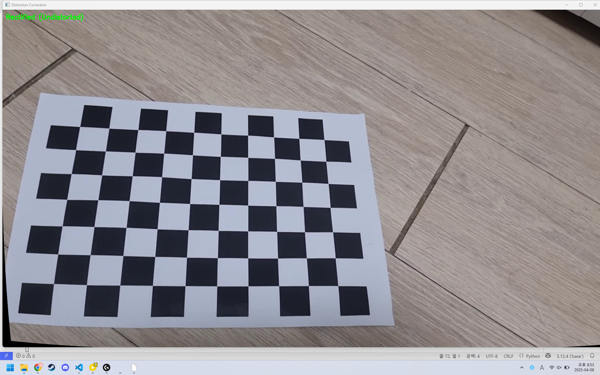

# 📸 Camera Calibration & Lens Distortion Correction

이 프로젝트는 OpenCV를 사용하여 체스보드 패턴 기반 카메라 캘리브레이션을 수행하고, 이를 바탕으로 렌즈 왜곡을 보정하는 데모입니다.

---

## 🧪 1. Camera Calibration

### ✔️ Calibration Process

1. 동영상(`chessboard.mp4`)에서 체스보드 코너 검출
2. 내부 파라미터 및 왜곡 계수 추정
3. 보정 결과 출력

### 📐 Intrinsic Parameters

| Parameter | Value         |
|----------:|---------------|
| fx        | 1972.3442     |
| fy        | 1920.0901     |
| cx        | 1042.9267     |
| cy        | 296.8256      |

### 🌀 Distortion Coefficients

| Coefficient | Value     |
|-------------|-----------|
| k1          | -0.167291 |
| k2          | 0.543998  |
| p1 (tangential) | 0.0   |
| p2 (tangential) | 0.0   |
| k3          | 0.0       |

### 🎯 Reprojection Error

- **RMSE**: `1.2653`  
  → 보정 정확도가 양호하며, 코너 검출 품질도 안정적인 수준입니다.

---

## 🧼 2. Lens Distortion Correction

왜곡된 카메라 이미지를 보정하여 **직선 유지**, **왜곡 제거**를 수행합니다.

- `ESC`: 종료  
- `r`: 원본 / 보정 영상 토글

---

### 🖼️ Demo (Rectified Image)

| 원본 영상 (왜곡 포함) | → | 보정 영상 (왜곡 제거) |
|-----------------------|----|------------------------|
| **왜곡 있음** | → |  |

---

## 📁 Files

- `cv_hw3_1.py`  
  → 체스보드 코너 추출 및 카메라 보정

- `cv_hw3_2.py`  
  → 실시간 렌즈 왜곡 보정

- `chessboard.mp4`  
  → 캘리브레이션용 입력 영상

- `screenshot.png`  
  → 보정 후 결과 이미지 캡처

---

## ✅ Requirements

- Python 3.x
- OpenCV (cv2)
- Numpy

```bash
pip install opencv-python numpy
